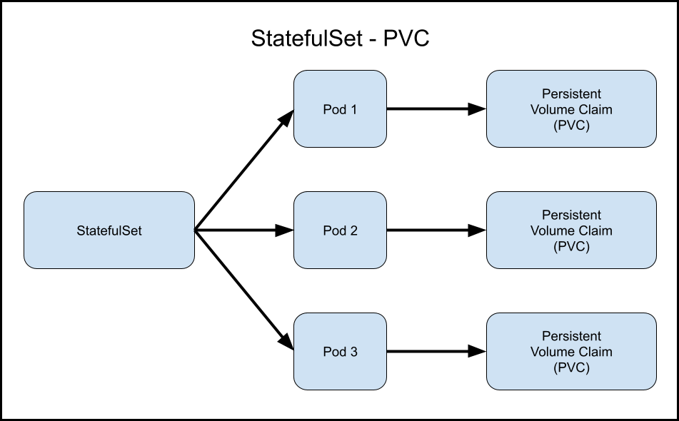
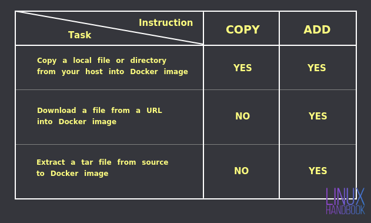
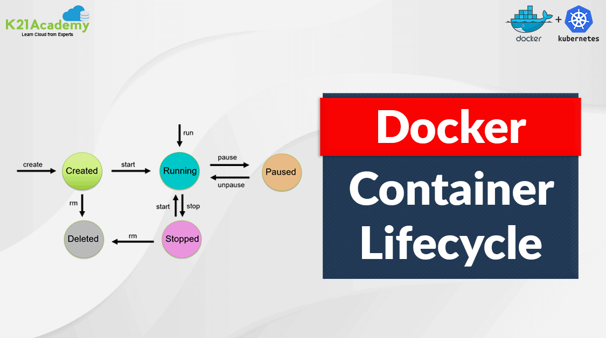
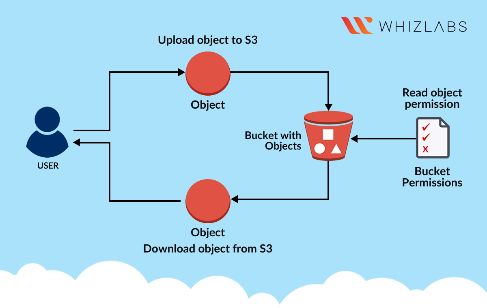
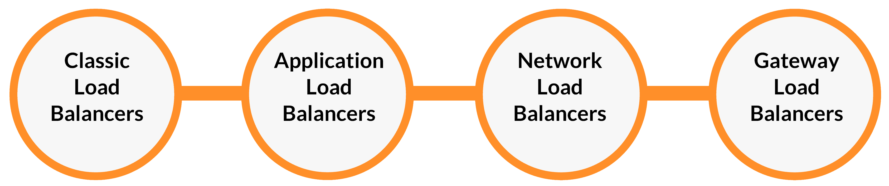

==================
# qt interview 

1.what is ec2 lifecycle ?

2. what is statefulset ?

   # A StatefulSet is a set of pods with a unique, persistent hostname and ID. StatefulSets are designed to run stateful applications in Kubernetes with dedicated persistent storage.
   # A deployment allows us to describe an application's life cycle. Such as, which images to use for the app, the number of pods there should be, and how they should be updated. A StatefulSets are more suited for stateful apps. A stateful application requires pods with a unique identity (for instance, hostname)

3. what is deamonset ?
  #  A Daemonset is another controller that manages pods like Deployments, ReplicaSets, and StatefulSets. It was created for one particular purpose: ensuring that the pods it manages to run on all the cluster nodes. As soon as a node joins the cluster, the DaemonSet ensures that it has the necessary pods running on it.
4. whta is ADD VS COPY ?

 ADD and COPY are Dockerfile instructions used to copy files and directories from the Docker build context into the Docker image being created. However, they have different behaviors and use cases:

COPY:
Syntax: COPY <src> <dest>
Copies files or directories from the host machine (or the build context) into the image.
Recommended for copying local files and directories into the image during the build process.
Does not support URLs or extraction of tarballs or compressed files.
Example:

Dockerfile
Copy code
COPY app.jar /usr/local/app/
Save to grepper
ADD:
Syntax: ADD <src> <dest>
Similar to COPY but with additional features:
Supports copying local files, directories, URLs, and remote tarballs/compressed files.
Automatically extracts compressed files (e.g., .tar, .tar.gz, .tgz, .zip) during the copy operation.
Can be used to fetch files from URLs and add them to the image.
Because of its additional features, it's sometimes considered more powerful but should be used judiciously to avoid unexpected behavior.
Example:

Dockerfile
Copy code
ADD https://example.com/app.tar.gz /usr/local/app/
Save to grepper
Best Practices:

Use COPY when copying local files or directories into the image, especially if you don't need the additional features of ADD.
Use ADD sparingly and only when you specifically need its extra capabilities, such as extracting compressed files or fetching remote resources.
In most cases, COPY is sufficient for copying files and directories from the build context into the Docker image.

1. what is CMD vs ENTRYPOINT ?
 # CMD and ENTRYPOINT are two instructions that you can use in a Dockerfile to define what commands or processes will run when you start a container from an image. They have some differences and similarities that you need to understand.
CMD defines the default command or parameters that will run when you start a container. You can use CMD to provide a default argument for an executable defined by ENTRYPOINT, or to run a standalone command. You can also override CMD by providing a different command or argument when you run the container. For example, if you have a Dockerfile with CMD ["echo", "Hello World"], you can override it by running docker run myimage echo Goodbye World. CMD is useful when you want to provide a default behavior for your container that can be easily changed by the user.
ENTRYPOINT defines the specific executable that will run when you start a container. You cannot override ENTRYPOINT unless you use the --entrypoint flag when you run the container. For example, if you have a Dockerfile with ENTRYPOINT ["ping"], you cannot override it by running docker run myimage echo Hello World. You have to use docker run --entrypoint echo myimage Hello World. ENTRYPOINT is useful when you want to define a container as an executable that always runs the same command or process.
You can also combine CMD and ENTRYPOINT to define a container with a specific executable and a default parameter that can be modified easily. For example, if you have a Dockerfile with ENTRYPOINT ["ping"] and CMD ["google.com"], you can run the container as docker run myimage and it will ping google.com by default. But you can also change the parameter by running docker run myimage yahoo.com and it will ping yahoo.com instead. This way, you can use the same image for different purposes without changing the executable.

# What is difference between run and CMD in Docker?
What is the difference between RUN and CMD in a Dockerfile ...
CMD is typically used to start a service or application in the container. To summarize, RUN is used to execute commands during the build process of a Docker image, while CMD is used to specify the default command to run when a Docker container is started from the image.

1. Docker lifecycle ?

# The lifecycle of a Docker container involves creation, running, stopping, and removal. Containers are created from Docker images, run as isolated instances, can be stopped or paused, and can be removed when no longer needed
2. what is s3 ?

# You can use Amazon S3 to store and retrieve any amount of data at any time, from anywhere. To get the most out of Amazon S3, you need to understand a few simple concepts. Amazon S3 stores data as objects within buckets. An object consists of a file and optionally any metadata that describes that file.

# Amazon Simple Storage Service (Amazon S3) is an object storage service offering industry-leading scalability, data availability, security, and performance

3. what are storage classess ?
 
 persistent 
 longtime
 frequently used classes 
 infreuent clasess
# What are the 3 types of storage in AWS?
There are three main cloud storage types: 

(i)object storage, =s3
(ii)file storage,==file efs
(iii)block storage.= ebs
storage classes related to s3

9.Loadbalancer types ?
 Further aiding your availability, AWS Elastic Load Balancing supports three types of load balancers:
  # Application Load Balancers, 
  # Network Load Balancers, and 
  # Classic Load Balancers. 
  You can load each based upon your needs.
  # An Application Load Balancer routes traffic for HTTP-based requests.
# A Network Load Balancer routes traffic based on IP addresses. ...
# A Gateway Load Balancer routes traffic to third-party virtual appliances.

10.what is autoscaling ?
# AWS Auto Scaling monitors your applications and automatically adjusts capacity to maintain steady, predictable performance at the lowest possible cost. Using AWS Auto Scaling, it's easy to setup application scaling for multiple resources across multiple services in minutes.

11.what application protocol ?
# HTTP/HTTPS. HTTP stands for Hypertext Transfer Protocol
 and HTTPS is the more secured version of HTTP, that's why HTTPS stands for ...
# +++++++++++++++++++++++
# What are the 7 layers of networking?
From lowest-level to highest-level they are:
#1. The Physical Layer.
#2. The Data Link Layer.
#3. The Network Layer.
#4. The Transport Layer.
#5. The Session Layer.
#6. The Presentation Layer.
#7. The Application Layer.

============= 
Job Description
This is a remote position.

Infrastructure as Code (IaC): Design, develop, and maintain Infrastructure as Code using tools such as CloudFormation, Terraform, or AWS CDK. Create templates that define the infrastructure architecture, ensuring scalability, security, and reliability.
Continuous Integration and Deployment (CI/CD): Implement and manage CI/CD pipelines to automate the build, testing, and deployment of applications. Utilize tools like Jenkins, AWS CodePipeline, or GitHub Actions to ensure efficient and reliable release processes.
Cloud Architecture Design: Collaborate with architects and development teams to design cloud-native solutions that leverage AWS services effectively. Optimize application architecture for high availability, fault tolerance, and cost efficiency.
Server Configuration and Management: Set up and configure AWS services such as EC2 instances, load balancers, auto-scaling groups, and databases. Monitor and maintain server infrastructure for optimal performance.
Containerization and Orchestration: Implement containerization using Docker and container orchestration with Kubernetes or Amazon ECS. Ensure the availability and scalability of applications in containerized environments.
Monitoring and Logging: Implement monitoring and logging solutions using tools like AWS CloudWatch, ELK stack (Elasticsearch, Logstash, Kibana), or Prometheus/Grafana to proactively identify and resolve issues.
Security and Compliance: Implement security best practices, configure IAM roles and permissions, manage security groups, and monitor for vulnerabilities. Ensure compliance with industry standards and regulations.
Backup and Disaster Recovery: Develop and maintain backup and disaster recovery strategies for critical data and applications. Implement automated backup solutions and perform regular recovery testing.
Performance Optimization: Analyze application performance, identify bottlenecks, and optimize resource utilization. Fine-tune AWS services and infrastructure to deliver optimal user experiences.
Collaboration and Documentation: Work closely with cross-functional teams to gather requirements, troubleshoot issues, and provide technical support. Document configurations, processes, and best practices.
Research and Innovation: Stay up-to-date with the latest AWS services, trends, and DevOps methodologies. Identify opportunities to enhance the existing infrastructure and processes through innovation.

Requirements

Bachelor's degree in Computer Science, Engineering, or related field (or equivalent experience).
Proficiency in AWS services including but not limited to EC2, S3, RDS, Lambda, CloudFormation, IAM, VPC.
Strong experience with CI/CD tools such as Jenkins, AWS CodePipeline, or GitHub Actions.
Solid scripting skills in languages like Python, Bash, or PowerShell.
Hands-on experience with containerization tools like Docker and orchestration platforms like Kubernetes or Amazon ECS.
Familiarity with Infrastructure as Code (IaC) using tools like Terraform or AWS Cloud Development Kit (CDK).
Strong understanding of networking concepts and security best practices in the cloud.
Experience with monitoring and logging tools such as AWS CloudWatch, ELK stack, or Prometheus/Grafana.
Excellent problem-solving skills and the ability to troubleshoot complex issues in distributed systems.
Certifications such as AWS Certified DevOps Engineer, AWS Certified Solutions Architect, or Kubernetes certification are a plus.
Effective communication skills and the ability to collaborate with cross-functional teams.